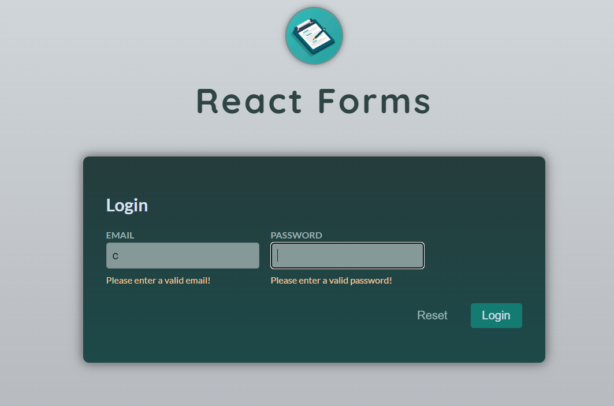
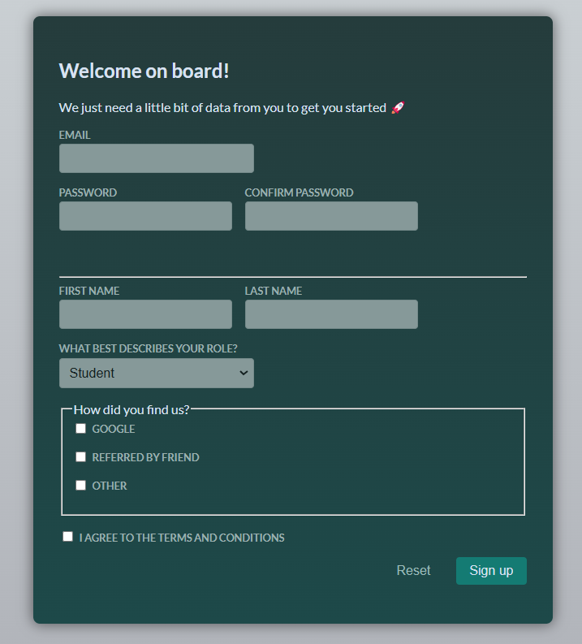

# Forms User Input REACT

This is an small project where I use different alternatives to create Forms/Input for users with REACT.

## Table of contents

- [Overview](#overview)
  - [Screenshot](#screenshot)
- [My process](#my-process)
  - [Built with](#built-with)
  - [What I learned](#what-i-learned)
  - [Continued development](#continued-development)
  - [Useful resources](#useful-resources)
- [Author](#author)
- [Acknowledgments](#acknowledgments)

## Overview

### Screenshot





## My process

### Built with

- React
- CSS custom properties
- CSS Flex box

### What I learned

Throughout this project, I discovered the numerous ways to create forms using React. This project showcases three different methods for handling Forms and Input elements.

In the first method (Login.jsx), I utilize the React hook useRef to manage and access elements within the DOM. This approach provides a straightforward way to handle a small form.

```js
const email = useRef();
const password = useRef();

function handleSubmit(event) {
  event.preventDefault();

  const enteredEmail = email.current.value;
  const enteredPassword = password.current.value;
}
```

In the second method (StateLogin.jsx), I utilized a custom hook (useInput.js) to handle input and validate values, managed with states (useState). Additionally, I employed components and utilities (Input.jsx, validation.js) to maintain cleaner and more organized code.

```js
const {
  value: emailValue,
  handleInputChange: handleEmailChange,
  handleInputBlur: handleEmailBlur,
  hasError: emailHasError,
} = useInput("", (value) => isEmail(value) && isNotEmpty(value));
```

For the last method (Signup.jsx), I developed a more extensive form. I leveraged browser tools for input handling and incorporated HTML validation features as needed.

```js
const fd = new FormData(event.target);
const acquisitionChannel = fd.getAll("acquisition");
const data = Object.fromEntries(fd.entries());
data.acquisition = acquisitionChannel;
```

### Continued development

I plan to further develop my skills with React Hooks by working on a food order application.

### Useful resources

- [Example resource 1](https://www.udemy.com) - I developed this small application through the course Dive in and learn React.js from scratch! by Maximilian Schwarzmüller - Udemy.

## Author

- Website - [Daniela Serrano](https://github.com/danielaser)

## Acknowledgments

As a junior developer, I found the Udemy course Dive in and Learn React.js from Scratch! by Maximilian Schwarzmüller to be incredibly valuable. It has helped me create cleaner React applications and gain a better understanding of key concepts (#useful-resources).
